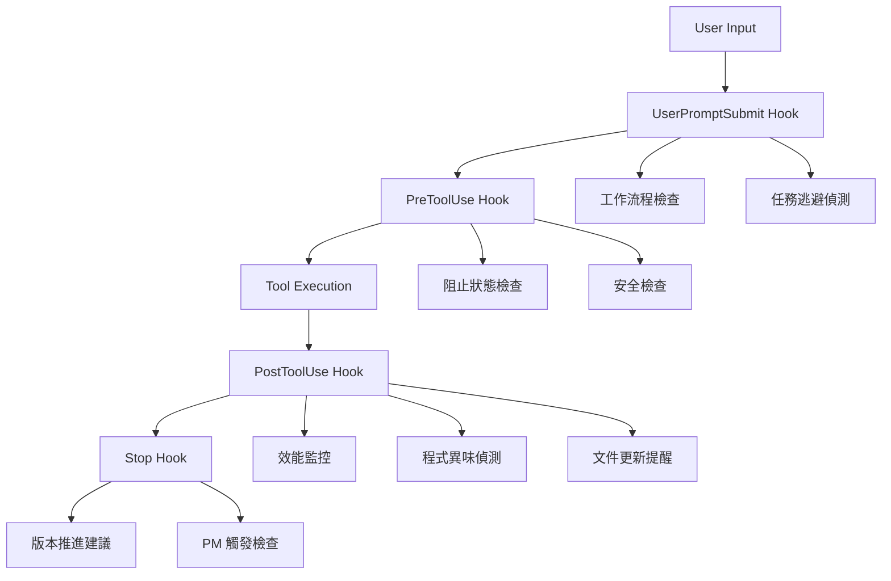

# 🔧 Hook 系統快速參考

本文件是 Hook 系統入口索引。需要設計新 Hook 時，先用本文件定位事件與能力，再依情境讀治理規則、方法論或技術參考。

> 外部規格來源：Claude Code Hooks reference（`https://code.claude.com/docs/en/hooks`）。

---

## Hook 能力導覽

| 主題 | 入口 |
|------|------|
| 事件何時觸發 | 本文件「Hook 事件總覽」 |
| 事件選擇與啟動/完成分流 | `.claude/methodologies/hook-system-methodology.md` |
| 修改審核、HTTP hook、`if` 條件治理 | `.claude/pm-rules/hook-governance.md` |
| JSON input/output、permissionDecision、HTTP 範例 | `.claude/references/hook-architect-technical-reference.md` |
| Hook 測試執行方式 | `.claude/hooks/tests/README.md` |
| 撰寫掃描 / 路徑比較 / 執行事實推斷邏輯時的紀律 | 本文件「撰寫紀律：掃描 / 路徑 / 執行事實」 |

---

## Hook 事件總覽

| Event | 觸發時機 | Matcher |
|-------|----------|---------|
| `SessionStart` | Session 開始或 resume | `startup` / `resume` / `clear` / `compact` |
| `InstructionsLoaded` | CLAUDE.md 或 `.claude/rules/*.md` 載入 context | load reason |
| `UserPromptSubmit` | 使用者 prompt 送出、Claude 處理前 | 無 matcher |
| `PreToolUse` | 工具執行前，可阻止工具 | tool name |
| `PermissionRequest` | 權限對話出現時 | tool name |
| `PermissionDenied` | auto mode classifier 拒絕工具時 | tool name |
| `PostToolUse` | 工具成功執行後 | tool name |
| `PostToolUseFailure` | 工具執行失敗後 | tool name |
| `Notification` | Claude Code 發出通知時 | notification type |
| `SubagentStart` | subagent 被 spawn 時 | agent type |
| `SubagentStop` | subagent 完成時 | agent type |
| `TaskCreated` | `TaskCreate` 建立 task 時 | 無 matcher |
| `TaskCompleted` | task 被標記 completed 時 | 無 matcher |
| `Stop` | 主 agent 完成回應時 | 無 matcher |
| `StopFailure` | turn 因 API error 結束時 | error type |
| `TeammateIdle` | agent team teammate 即將 idle 時 | 無 matcher |
| `ConfigChange` | 設定檔在 session 中變更時 | configuration source |
| `CwdChanged` | 工作目錄改變時 | 無 matcher |
| `FileChanged` | watched file 在磁碟上變更時 | literal filenames |
| `WorktreeCreate` | `--worktree` 或 `isolation: "worktree"` 建立 worktree 時 | 無 matcher |
| `WorktreeRemove` | worktree 被移除時 | 無 matcher |
| `PreCompact` | context compaction 前 | `manual` / `auto` |
| `PostCompact` | context compaction 完成後 | `manual` / `auto` |
| `Elicitation` | MCP server 在 tool call 中要求使用者輸入時 | MCP server name |
| `ElicitationResult` | 使用者回覆 MCP elicitation 後 | MCP server name |
| `SessionEnd` | Session 終止時 | end reason |

**Matcher 規則**：

- `PreToolUse`、`PostToolUse`、`PostToolUseFailure`、`PermissionRequest`、`PermissionDenied` 以 tool name 匹配。
- `UserPromptSubmit`、`Stop`、`TeammateIdle`、`TaskCreated`、`TaskCompleted`、`WorktreeCreate`、`WorktreeRemove`、`CwdChanged` 不支援 matcher。
- `if` 只在 tool events 上使用；非 tool event 設定 `if` 不會執行。
- `FileChanged` 的 matcher 是 watched filename 清單，不使用一般 tool matcher 規則。

**名稱校準**：

| 名稱 | 狀態 | 使用指引 |
|------|------|----------|
| `Setup` | 非官方 Hook event 名稱 | 依需求改用 `SessionStart`、`InstructionsLoaded`、`ConfigChange`、`CwdChanged` 或 `FileChanged` |

## 📋 Hook 執行流程



## 🎯 三大鐵律自動執行

| 鐵律 | Hook 實現 | 觸發條件 | 執行方式 |
|------|-----------|----------|----------|
| **測試通過率鐵律** | UserPromptSubmit + PreToolUse | ESLint 錯誤檢測 | 記錄追蹤 + 強制修復提醒 |
| **永不放棄鐵律** | Task Avoidance Detection | 禁用詞彙/逃避行為 | **完全阻止操作** |
| **架構債務零容忍鐵律** | Code Smell Detection + PostEdit | 程式異味偵測 | 自動 Agent 處理 |

## 🚨 關鍵 Hook 說明

### Task Avoidance Detection Hook
**最高優先級 - 強制阻止機制**

#### 禁用詞彙清單
```text
"太複雜", "暫時", "跳過", "之後再改", "先將就"
"暫時性修正", "症狀緩解", "時間不夠", "複雜度太高"
"不在這次範圍", "留待後續處理", "workaround"
```

#### 觸發阻止的條件
- 工作記錄中包含任何禁用詞彙
- 跳過的測試 (`skip`, `pending`, `xdescribe`, `xit`)
- 過多的 ESLint 忽略 (>5 處)
- 技術債務過度累積 (>15 個 TODO/FIXME)
- 程式碼變更但沒有測試更新

#### 解除阻止流程
1. 檢查報告: `cat .claude/hook-logs/avoidance-reports/[latest].md`
2. 修正所有逃避行為
3. 移除禁用詞彙，重新描述解決方案
4. 修復所有跳過的測試
5. 處理所有技術債務
6. 執行: `rm .claude/TASK_AVOIDANCE_BLOCK`

### Architecture Debt Detection Hook 🆕
**架構債務偵測 - 強制正確修正順序**

- **觸發時機**: PostEdit - 程式碼變更後
- **功能**:
  - 偵測重複服務實作（如多個 GoogleBooksApiService）
  - 檢查架構原則違規（Domain 層依賴具體實作）
  - 驗證測試架構一致性（重複 Mock、使用真實服務）
  - 生成正確的重構順序指南
- **核心原則**: **文件 → 測試 → 實作 → 介面**
- **阻擋機制**: 發現架構問題時阻止繼續執行，強制先修正文件和測試
- **輸出檔案**:
  - `.claude/hook-logs/architecture-issues.md` - 詳細問題報告
  - `.claude/ARCHITECTURE_REVIEW_REQUIRED` - 審查標記

### Task Documentation Validation Hook 🆕
**任務規劃自動檢查 - 方法論合規性**

- **觸發時機**: PostEdit - 工作日誌檔案修改後
- **目標檔案**: `<worklog-path>`
- **執行順序**: order 30 (在 Code Smell Detection Hook 之後)

#### 檢查項目

**強制章節** (必須存在):
- 📋 參考文件
- 📁 影響範圍

**參考文件子章節** (必須完整):
- UseCase 參考
- 流程圖參考（具體到 Event）
- 架構規範
- 依賴類別
- 測試設計參考

**影響範圍子章節** (必須完整):
- 需要建立的檔案
- 需要修改的檔案
- 預估影響的測試檔案
- 影響的依賴關係

#### 檢查等級

1. **✅ 完全符合**: 所有強制章節和子章節都存在
2. **⚠️ 部分缺失**: 強制章節存在，但子章節不完整
3. **❌ 嚴重缺失**: 缺少強制章節，任務規劃不合格

#### 輸出檔案

- 檢查報告: `.claude/hook-logs/task-doc-validation/validation-YYYYMMDD-HHMMSS.md`
- 包含詳細缺失項目和補充建議模板
- 缺失時提供完整的參考文件和影響範圍模板

#### 使用範例

查看最新檢查報告:
```bash
ls -lt .claude/hook-logs/task-doc-validation/ | head -2
```

> 手動執行檢查原引用 `.claude/hooks/post-edit-task-doc-validation.sh`，該檔已刪除，settings.json 亦無對應註冊 hook 承接此路徑，判定功能已廢除，段落已移除（2026-08-22 文件複查）。<!-- broken-link-exempt: 本行為更正說明，其內容正是在陳述該路徑已刪除，路徑不存在是預期的 -->

### Code Smell Detection Hook
**智能品質控制 - Agent 整合**

#### 偵測的程式異味
- **長函數** (>30行)
- **深層巢狀** (>4層)
- **大型類別** (>200行)
- **過長參數列表** (>5個)
- **程式碼重複** (>5處)
- **魔術數字** (>3處)
- **高耦合** (>10個依賴)

#### Agent 自動處理流程
1. 偵測異味 → 生成結構化報告
2. 啟動背景 Agent → 更新 TodoList
3. 按嚴重程度分類 (High/Medium/Low)
4. 不中斷開發流程

### Performance Monitor Hook
**系統效能監控**

#### 效能閾值
- ✅ 理想: < 1秒
- ⚠️ 警告: 2-5秒
- ❌ 錯誤: > 5秒

#### 監控指標
- Hook 執行時間
- 記憶體使用量
- 執行頻率統計
- 效能趨勢分析

### PM Trigger Hook
**智能專案管理介入機制**

#### 觸發條件
- **TDD 階段轉換**: Phase 1-4 完成標記檢測
- **進度停滯**: 工作日誌超過 2 天未更新
- **複雜度超標**: 技術債務 >15 個或 ESLint 錯誤 >50 個
- **Agent 升級請求**: 工作日誌中包含升級關鍵字
- **里程碑接近**: 版本號接近重要節點 (0.9.x → 1.0.0)

#### 觸發動作
- 生成 PM 狀態檔案 `.claude/pm-status.json`
- 建立介入提醒 `.claude/PM_INTERVENTION_REQUIRED`
- 記錄觸發原因和當前上下文
- 提供具體的 PM 行動建議

#### PM 狀態檢查工具
使用 `.claude/scripts/pm-status-check.py` 查看：
- 觸發狀態和原因
- 當前工作進度
- TodoList 優先級分析
- 技術債務狀況
- 版本推進建議

（2026-08-22 文件複查更正原路徑 `./scripts/pm-status-check.sh`）<!-- broken-link-exempt: 本行為更正說明，原路徑不存在是預期的 -->

## 📁 Hook 檔案位置

```text
scripts/
├── startup-check-hook.sh              # SessionStart
├── prompt-submit-hook.sh               # UserPromptSubmit
├── task-avoidance-detection-hook.sh    # UserPromptSubmit (逃避偵測)
├── task-avoidance-block-check.sh       # PreToolUse (阻止檢查)
├── pre-commit-hook.sh                  # PreToolUse (Git)
├── pre-test-hook.sh                    # PreToolUse (測試)
├── post-edit-hook.sh                   # PostToolUse (編輯)
├── post-test-hook.sh                   # PostToolUse (測試)
├── code-smell-detection-hook.sh        # PostToolUse (異味偵測)
├── post-edit-task-doc-validation.sh    # PostToolUse (任務規劃檢查) 🆕
├── architecture-debt-detection-hook.sh # PostToolUse (架構債務檢測)
├── auto-documentation-update-hook.sh   # PostToolUse (文件提醒)
├── performance-monitor-hook.sh         # 通用效能監控
├── stop-hook.sh                        # Stop
├── pm-trigger-hook.sh                  # Stop (PM 觸發檢查)
└── pm-status-check.sh                  # PM 狀態檢查工具
```

## 🔧 設定檔案

**`.claude/settings.local.json`** - Hook 配置
- SessionStart: 環境檢查
- UserPromptSubmit: 合規性檢查 + 逃避偵測
- PreToolUse: 阻止檢查 + 安全檢查
- PostToolUse: 品質檢查 + 異味偵測 + 文件提醒
- Stop: 版本推進建議

## 📊 日誌和報告

### 日誌位置
```text
.claude/hook-logs/
├── startup-[timestamp].log
├── prompt-submit-[timestamp].log
├── post-edit-[timestamp].log
├── code-smell-[timestamp].log
├── task-doc-validation/           # 任務文件檢查報告 🆕
│   └── validation-[timestamp].md
├── performance/
│   ├── perf-monitor-[date].log
│   └── metrics.csv
├── smell-reports/
├── avoidance-reports/
└── issues-to-track.md
```

### 重要檔案
- **`.claude/TASK_AVOIDANCE_BLOCK`** - 阻止狀態標記
- **`.claude/pm-status.json`** - PM 觸發狀態記錄
- **`.claude/PM_INTERVENTION_REQUIRED`** - PM 介入提醒標記
- **`issues-to-track.md`** - 問題追蹤提醒
- **`metrics.csv`** - 效能監控資料

## ⚡ 緊急操作

### 解除所有阻止
```bash
# 僅在緊急情況下使用
rm -f .claude/TASK_AVOIDANCE_BLOCK
```

### 檢查當前狀態
```bash
# 檢查是否有阻止狀態
ls -la .claude/TASK_AVOIDANCE_BLOCK

# 檢查 PM 觸發狀態
./scripts/pm-status-check.sh

# 查看最新問題
cat .claude/hook-logs/issues-to-track.md

# 檢查最新異味報告
ls -t .claude/hook-logs/smell-reports/ | head -1
```

### 手動執行關鍵檢查

> 本節原列 5 項手動檢查指令，其中 4 項（逃避偵測 / 程式異味 / 效能分析 / PM 觸發檢查）指向的 `.sh` 腳本已刪除，且 settings.json 無對應註冊 hook 承接，判定功能已廢除，已移除（2026-08-22 文件複查）。僅存續 LSP 環境檢查，並改為顯式解譯器前綴（消除對可執行位的依賴）。

```bash
# 手動執行 LSP 環境檢查
uv run --quiet --script .claude/hooks/lsp-environment-check.py
```

## 撰寫紀律：掃描 / 路徑 / 執行事實

> 來源：跨票收斂分析（同一天六張路徑處理與掃描相關 P0/P1 缺陷的共同根因整理）。局部修復已各自完成，本節是收斂結論的落地，避免下一個遍歷函式、路徑比較或執行事實推斷再度重現同一形態。

### 紀律一：掃描上限

**規則**：任何遍歷 `.claude/hook-logs/`、`docs/work-logs/**/tickets/`，或資料量隨時間單調成長之目錄的函式，必須具備下列至少一項機制，並在 docstring 註明採用哪一項與其假設：

| 機制 | 範例 |
|------|------|
| 檔案數上限 + 取樣估計外推 | `scan_logs` 的 `MAX_FILES_PER_DIR` 取樣估計 |
| 時限包裝（timeout / alarm） | — |
| 僅首層掃描不遞迴 | `hook-health-monitor` 改為 scandir 首層限制 |

**Why**：`_newest_file_mtime` 原始版本無上限遞迴掃描，與 `scan_logs` 對 hook-logs 全樹逐檔 stat，皆假設「這個目錄不會長到影響效能」，未實測即上線；規模達 667k 檔時才顯形。

**Consequence**：SessionStart 掛載的 hook 在此規模下逾時（實測 60+ 秒至 86.4 秒），使整個 session 啟動卡住，且症狀只在資料量達臨界值後才出現——開發期小樣本測試不會發現。

**Action**：新增此類函式時，ticket 的 Solution 必須明列採用哪一項機制。機制種類若屬「保留期」「快取失效」等宣稱式保護，須額外附至少一次實測覆蓋率數字（如「7 天保留期實測逾期殘留率 1.9%」），不可僅憑程式碼存在宣稱機制生效——「機制存在」與「機制生效」是兩件事，前者程式碼審查看得到，後者需要實測數字才能區分。

### 紀律二：路徑比較正規化

**規則**：比對兩個路徑是否相同或屬於同一集合前，雙方皆須先正規化為相對 repo 根目錄的 POSIX 字串再比較。不強制合併為單一 import（不同 skill 各自有獨立同步邊界），但新寫路徑比較邏輯須遵循三要件：

(a) 比較前雙邊都正規化，不可比較「一邊正規化一邊原樣」。
(b) `repo_root` 解析失敗時 fail-open（原樣回傳，降級為未正規化行為），非 fail-closed（拋錯中斷流程）。
(c) 用 POSIX 分隔符字串比較，不用 `Path.__eq__`（跨平台分隔符與 trailing slash 差異會使集合比較失準）。

**先例**：`ticket-md-auto-commit-hook.py::_normalize_to_repo_relative` + `_resolve_repo_root`、`git_ops.py::commit_files_isolated` 內建 `os.path.relpath` 正規化——兩者現況皆已符合三要件，可作範例參照，不要求回頭重構既有兩處。

**其他樣本**：commit 子命令的路徑範圍語意——以路徑作為 `git commit` 引數時，其語意是「以這些路徑的 working tree 內容重建暫存區」而非「篩選既有暫存區內容」，未正規化這層語意差異即造成提交範圍與呼叫者預期不符，且共用暫存區下會夾帶其他呼叫者尚未預期提交的變更（與下方紀律二之一/二之二的「基底」問題無關，屬路徑比較正規化的另一種樣態，故列於此）。

**Why**：兩處各自獨立實作等價邏輯，顯示「路徑比較未正規化」是可重現的形態，不是單一 bug。

**Consequence**：未正規化時，字串比較因一邊絕對路徑、一邊相對路徑，或跨平台分隔符差異而恆假不等，導致目標路徑被誤判為「未被追蹤」（症狀：應提交的檔案被 auto-commit 遺漏）。

**Action**：新寫路徑比較邏輯時對照上述三要件實作，不強制引入單一共用 helper。

### 紀律二之一：路徑基底須由 git toplevel 推導，不得依賴 cwd

**規則**：任何需要「相對路徑基底」的邏輯（正規化、掃描起點、範圍宣告比對）必須以 `git rev-parse --show-toplevel` 或等價機制推導基底，不得假設 `os.getcwd()` 等於 repo 根或專案根。同一份程式碼存在多種執行入口——CLI 直接呼叫、cwd-resolving shim（如以 `uv run --directory <skill>` 啟動）、hook 觸發、測試環境——各入口的 cwd 可能不同，只寫「用絕對路徑」不足以避免問題，因為絕對路徑仍可能是「相對於錯誤基底算出的絕對路徑」。

**Why**：多執行入口是既存事實而非例外情況，基底若依賴 cwd，正確性就取決於呼叫者從哪裡啟動——這是呼叫端無法穩定保證的環境變數，不是程式邏輯可控的輸入。

**Consequence**：以下三例皆假設了一個「通常成立但非必然」的 cwd，且假設在特定入口下失準：

| 案例 | 假設的基底 | 實際基底 |
|------|-----------|---------|
| 監測腳本 | cwd = 專案根 | 執行位置為其他工作目錄 |
| commit 子命令 | `os.getcwd()` = repo 根 | 經 cwd-resolving shim 啟動時為 skill 目錄 |
| sync manifest hash 比對 | 遞迴列舉的起點可控制在已排除路徑之外 | 起點固定為整個 `.claude/`，排除清單對起點本身無作用 |

**Action**：新寫任何依賴「當前目錄」語意的邏輯前，先確認函式可能被哪些入口呼叫；基底一律以 `git rev-parse --show-toplevel`（或專案既有的 `_resolve_repo_root` 等價 helper）推導，不直接使用 `os.getcwd()` 或依賴呼叫者已在正確目錄下執行的隱含假設。

### 紀律二之二：基底解析失敗時必須明確報錯，不得降級為空結果或預設值

**規則**：基底路徑解析失敗或與預期不符時，必須拋出可辨識的錯誤，不得靜默降級為「查無資料」「範圍外」等看似合法的結果，也不得回退為預設值繼續執行。

**Why**：靜默降級與「資料真的不存在」在輸出形態上無法區分，呼叫端與後續讀者只能看到結果本身，看不到結果是「基底解析失敗的副作用」還是「查詢結果本就如此」。

**Consequence**：本節列舉的路徑處理案例中，多數屬於此類靜默失敗：監測腳本回報「無記錄」（實際是讀錯路徑）；commit 子命令回報「不在宣告範圍內」（實際是 cwd 基底錯誤，被誤診斷為使用者操作錯誤）；sync manifest hash 比對只是變慢直到逾時（無任何錯誤訊號）；紀律一「掃描上限」所述的無上限遞迴掃描在資料量夠大時同樣只是逾時，不會提前示警。對照組：健康監測工具以 HOOK_NAME 常數作 fallback 猜測失敗時，明確回報「log dir not found」——是少數符合本條要求的正例，可作為「明確報錯」的具體參照。

**Action**：基底解析或範圍比對邏輯遇到「無法確定基底」「輸入不在預期範圍」等情況時，明確拋出例外或回傳可識別的錯誤標記（非空字串、非空清單、非預設 boolean），訊息內容須指出「基底解析失敗」本身，而非套用通用的「找不到／不在範圍內」訊息使呼叫端誤以為是資料層面的正常結果。

### 紀律三：禁止以檔案系統狀態推執行事實

**規則**：禁止以檔案數、存在性、mtime 等檔案系統狀態直接推斷程式執行事實（是否執行過、執行了幾次、最近一次何時執行）。需要執行事實時讀日誌內容（解析時間戳或計數欄位）或使用專用狀態檔（如 liveness index），不從儲存層副作用回推。

**Why**：儲存層副作用與執行事實的對應關係由儲存策略決定，策略一旦改變，舊推論邏輯會安靜失真而非報錯：

- `scan_logs` 原以「每次觸發建立一個新檔」為前提，用檔名時間戳解析數量推算觸發頻率；日誌改為每日輪替 append 後，檔數恆為保留天數（7）而非觸發次數，統計靜默失真。
- `hook-health-monitor` 原以目錄本身 mtime 判斷是否過期；單一持久檔逐次 append 情境下，目錄項增減才更新目錄 mtime，檔案內容本身的 mtime 才反映最後寫入時間，用目錄 mtime 判準會誤判仍在使用中的 hook 為 FAIL。
- PC-BAL-033「鑑別方法／步驟 1」段：「零檔案本身即是結論」——將「目錄下無日誌檔」等同「未被呼叫」，但此推論僅在 hook 覆蓋 `run_hook_safely`（保證被呼叫必留至少一行 DEBUG）時才成立；未覆蓋時零檔案只是嫌疑訊號，仍需步驟 2、3 差分佐證，直接下結論即是本紀律描述的反例。
- 既有 error-pattern 診斷指引中「以 hook-logs 檔案數推論觸發次數」的步驟因每日輪替失效，需逐處標註替代診斷方法。
- 每日輪替上線後，「每目錄至多保留天數（如 7）個日誌檔」這個上限**只對持續被觸發的 hook 成立**。停止觸發的 hook（低頻的 SessionEnd 類 hook、實驗殘留目錄）因清理邏輯本身也只在該 hook 自身觸發時才執行，檔案數會凍結在最後活躍日不再增減——此時「有檔案」不帶任何時間資訊，不能反推「近期仍在觸發」。文件與程式碼皆不得寫成「每目錄最多 N 個日誌檔」這種全稱敘述，須加註「僅對持續觸發者成立」的限定。
- 一次性清空日誌目錄後，短期內「目錄不存在」等價於「清理後尚未觸發過」，比零檔案（可能只是輪替後的空窗）更可靠；但目錄一旦因某次觸發而建立就永久存在（cleanup 只刪過期檔案，不刪目錄本身），此判準僅在「清空後、首次觸發前」的短窗內成立，觸發一次即永久退化為不可用。若要在文件或程式碼中把「目錄是否存在」列為可用判準，必須同時寫明其有效期限（清空後到首次觸發前）與退化條件（觸發一次即失效），否則就是製造下一個「機制仍在但已測不到任何東西」的假保護——與紀律一「機制存在不等於機制生效」同一問題在執行事實推斷上的具體樣態。

**Consequence**：此類推論的失效是「安靜壞掉」而非顯性 FAIL——統計結果看起來合理（如「這支 hook 只觸發了 7 次」），不會有任何訊號顯示它是錯的，直到有人拿日誌內容或獨立實驗交叉比對才會揭穿。上述兩個邊界案例的失效樣態相同：判準在提出當下成立，但成立範圍未被寫清楚，之後條件一變就悄悄失守。

**Action**：需要「執行過幾次／最近一次何時／是否被呼叫」等執行事實時，讀日誌內容或建立專用狀態檔，不從檔案數、mtime、存在性回推。新增此類統計邏輯前，先確認其賴以運作的儲存策略現況（輪替頻率、單檔 vs 多檔、清理是否由被清理對象自身觸發），並在 docstring 註明此依賴——下個修改者需要這條線索，才能在策略再度變更時提前發現推論失真。若仍要提出以檔案系統狀態作為輔助判準（如上述「目錄存在性」短窗案例），文件必須同時寫明其有效期限與退化條件，不可只寫「可用」而省略邊界。

### 紀律四：改變資料分布的操作不可用依賴該分布的工具驗證

**規則**：清理、遷移、重置等會改變資料分布（命令格式、時間跨度、筆數結構）的操作，其驗收不得使用依賴該分布運作的工具（monitor 基線、頻率統計、以檔案數/日期推算的指標）。此類工具的判讀邏輯建立在「操作前的分布假設」上，操作本身正是改變假設的行為，同一操作因此會讓工具與被驗證對象一起變化，卻沒有訊號提醒使用者判讀邏輯已隨之失準。

**Why**：驗證工具與被驗證的資料分布共享同一組隱含假設，操作一旦改變分布，工具的判讀邏輯就跟著失準，而工具本身不會知道自己已經失準：

- 反例一：hook 註冊格式由裸路徑改為顯式解譯器形式的遷移完成後，監控工具的命令解析邏輯仍假設舊格式，新格式一律解析失敗，偵測到的 hook 數量靜默歸零而不拋錯——監控看起來仍在跑，只是什麼都沒測到，用它驗證這次遷移是否成功，等於用被同一遷移打壞的東西驗證這次遷移。
- 反例二：一次性日誌清理把橫跨多日的分布壓縮為單日集中之後，監控工具的頻率基線演算法（總筆數除以固定天數）除到的分母假設不再成立，跑出數十筆數學上必然、與實際異常無關的假警報，而清理操作本身正是製造這批假警報的原因。

**Consequence**：兩個反例都在「驗證階段」才被發現，且驗證結果一開始都「看似正常」（監控無輸出／監控有輸出但數字看似合理的警報）；要逐筆驗算或交叉比對才會揭穿。這類失效不會主動報錯，會安靜地讓下一次操作把「工具沒有異常訊號」誤讀為「操作成功」的證據。

**Action**：規劃改變資料分布的操作時，驗收管道須繞開依賴該分布的既有工具，改用下列任一獨立管道：

| 管道 | 說明 |
|------|------|
| 結構重建檢查 | 確認目錄結構經觸發後正確重建，不引用工具的歷史統計數字 |
| 直接計數 | 對照操作前後的原始檔案數/筆數，不透過中介工具的推算邏輯 |
| 工具自身的解析自檢 | 對監控工具的解析邏輯本身補測試案例覆蓋新分布下的輸入形式，而非把它的輸出結果當作驗收證據 |

操作後若既有工具的判讀仍依賴舊分布假設，須明文標註其失效窗口（比照紀律三），並在窗口內於相關流程中排除其訊號，不可讓「工具仍在跑」被誤讀為「訊號仍可信」。

### 紀律五：常數必須註明其假設的量級範圍，超出範圍時的行為必須明確

**規則**：任何帶業務語意的常數（分母、閾值、保留期等）的註解不能只寫「這是什麼」，必須同時寫明「在什麼條件下成立」——即其假設的量級範圍，以及輸入超出該範圍時系統的實際行為（是否有 fallback、是否會誤判、誤判方向為何）。此紀律比「不要用魔術數字」更精確：以下三例皆已有註解，問題不在缺註解，在註解只回答「是什麼」沒回答「何時成立」。

**Why**：「有註解的常數」與「不會產生誤判的常數」是兩件事。註解停在說明數值本身，就沒有回答這個值假設輸入落在哪個範圍；使用者與下一個修改者只看得到值，看不到值背後的假設邊界，直到情境變化使假設失守才會發現。

**Consequence**：本輪收斂涉及的三個假警報來源皆屬此類：

| 常數 | 註解說明的內容 | 未說明的成立範圍 |
|------|---------------|-----------------|
| 頻率基線分母（7） | 7 日平均 | 假設資料涵蓋 7 天；資料實際涵蓋天數 < 7 時，除出的基線被低估，任何非零觸發都會恆假觸發 WARNING |
| bootstrap 絕對閾值（100） | 無歷史資料時的保守下限 | 假設 hook 為低頻（每日個位數觸發）；套用到日均數千次觸發的高頻 hook 時必然觸發告警，與「保守」的設計初衷相反 |
| 日誌保留期（7 天） | 保留天數 | 對應「每次觸發建立一檔」的產生速率；產生策略改為單檔追加或高頻觸發時，同一保留期天數對應的檔案量級可差三個數量級 |

三者的失效樣態相同：常數在提出當下的假設成立，之後資料分布或使用情境一變，常數本身沒有變，但它的正確性前提已不成立，卻沒有任何訊號提醒。

**Action**：新增或審查帶業務語意的常數時，註解必須同時包含兩項：(1) 此值假設輸入落在什麼範圍（如「假設資料涵蓋至少 N 天」「假設觸發頻率為每日個位數」）；(2) 輸入超出此範圍時系統的行為（明確報錯、fallback 至替代邏輯、或已知會誤判且方向為何）。只寫「這是什麼」而不寫「何時成立」的常數註解視為不完整。

### 紀律六：代理量推目標量時，轉換率不得假設為常數

**規則**：以代理量（可直接量測的指標，如日誌行數、檔案數、資料量、保留天數）推算目標量（實際關心的指標，如觸發次數、異常程度、耗時）時，兩者間的轉換率是否為常數不得假設，須先驗證。撰寫或審查此類推算邏輯前，必須回答三問：

| 三問 | 內容 |
|------|------|
| 用的是代理量還是目標量？ | 明確區分正在量測的指標，與真正要回答的問題，是否同一個 |
| 轉換率是什麼？ | 代理量與目標量之間的映射關係為何（固定比例、非線性、依賴其他變數） |
| 常數還是變數，範圍多少？ | 轉換率本身是否隨其他條件（並行度、輪替策略、瓶頸類型）變動；若變動，須寫下已知變動範圍 |

**Why**：代理量易得、目標量難測，是選用代理量的常見理由；但「代理量與目標量成固定比例」本身是一個未驗證的假設，跨情境套用固定轉換率會使推算結果系統性偏離而不自知。此紀律與紀律五的分工不同：紀律五處理「常數的適用範圍未寫」（常數本身固定，缺的是適用邊界的說明）；本紀律處理「不該用常數的地方用了常數」（轉換率本身隨情境變動，卻被當單一數字套用）。

**Consequence**：以下六個樣本分屬不同 hook 與不同量測情境，皆是同一形態——把隨情境變動的轉換率當常數使用：

| 代理量 → 目標量 | 假設的轉換率 | 實際情況 |
|----------------|-------------|---------|
| 日誌行數 → 觸發次數 | 固定比例（1 行約等於 1 次） | 實測三支 hook 分別為 2.1、24.7、90.2 行/次，同一比例假設套用於不同 hook 時誤差達 43 倍 |
| 總筆數 → 日均 | 除以 7（假設資料涵蓋 7 天） | 資料實際僅涵蓋 1 天，除數與實際天數不符，日均值被低估近 7 倍 |
| 檔案數 → 觸發次數 | 檔案數與次數同步增減 | 日誌改為每日輪替 append 後，檔案數與觸發次數脫鉤，觸發仍持續但檔案數已凍結 |
| 資料量（GB）→ 清理耗時 | 耗時與資料量成正比 | 實際瓶頸為 inode 數量而非資料量，小檔案數多時耗時遠超資料量估算 |
| 保留天數 → 檔案量 | 檔案量與保留天數固定倍率 | 日產量隨並行度變動，同一保留天數對應的檔案量級可差一個數量級 |
| 絕對閾值（100/日）→ 異常判定 | 所有 hook 適用同一絕對值 | 各 hook 的日常觸發量級不同，同一絕對閾值對高頻 hook 恆常誤判、對低頻 hook 永不觸發 |

**Action**：撰寫或審查代理量推算目標量的邏輯時，必須先完成上述三問；若答不出轉換率的變動範圍（即「常數還是變數，範圍多少」無解），該代理量只能用於排序或趨勢判斷（如「這次比上次多」），不得用於需要絕對數值的判斷（如觸發閾值設定、異常告警、容量規劃）。與 PC-BAL-050（單點量測被措辭升級為分佈宣稱）同屬「證據強度被無條件放大」家族，差別在本紀律針對轉換率本身的量級假設，PC-BAL-050 針對單一取值被泛化為全參數範圍成立。

---

## 🎯 最佳實踐

### 開發者指引
1. **理解阻止機制** - 不要嘗試繞過，專注於修正問題
2. **接受品質標準** - Hook 系統是為了確保程式碼品質
3. **學習改善** - 查看報告了解改善方向
4. **主動預防** - 開發時就避免產生異味

### 專案管理指引
1. **監控趨勢** - 定期檢查效能和品質趨勢
2. **調整閾值** - 根據專案特性調整檢查標準
3. **培訓團隊** - 確保團隊理解 Hook 系統運作
4. **持續改善** - 根據實際使用情況優化 Hook

這個 Hook 系統確保專案始終維持最高的品質標準，是專案成功的重要基礎設施。

---

**Last Updated**: 2026-08-22 | **Version**: 1.3.1 — 更正 1.3.0 引入的 LSP 環境檢查解譯器前綴：`lsp-environment-check.py` 檔頭為 `#!/usr/bin/env -S uv run --quiet --script` + `# /// script` PEP 723 區塊（`dependencies = ["pyyaml"]`），依 PC-148 判準應以 `uv run --quiet --script` 呼叫，非 `python3`。原誤用 `python3` 曾實測 exit=0 可執行，但查證該次成功來自這台機器的系統 python3（`/opt/homebrew/lib/python3.14/site-packages/`）剛好已安裝 pyyaml，非 hook 自帶依賴——換無此套件的環境會 `ModuleNotFoundError`（PC-124 / IMP-069 記載的同型問題）。教訓：單次執行成功不能作為依賴正確性的證據，需檢查 hook 檔頭宣告的執行方式。

**Last Updated**: 2026-08-22 | **Version**: 1.3.0 — 修復 5 處失效引用：「使用範例」與「手動執行關鍵檢查」兩處合計 4 個已刪除 `.sh` 腳本（逃避偵測/程式異味/效能分析/PM 觸發檢查）與 1 個已刪除的工作日誌驗證腳本，經查證 settings.json 均無對應現行 hook 承接，判定功能已廢除並移除段落；LSP 環境檢查改為顯式解譯器前綴 `python3` 消除對可執行位的依賴。「關鍵 Hook 說明」等周邊區塊是否應整體改寫另立追蹤，不在本次處理範圍。

**Last Updated**: 2026-08-21 | **Version**: 1.2.0 — 「撰寫紀律」節新增紀律六（代理量推目標量時轉換率不得假設為常數，含三問檢查、六樣本同構表、實務出口；與紀律五分工：五處理常數適用範圍未寫，六處理不該用常數之處用了常數；與 PC-BAL-050 交叉引用）。

**Last Updated**: 2026-08-21 | **Version**: 1.1.0 — 「撰寫紀律」節新增紀律四（改變資料分布的操作不可用依賴該分布的工具驗證，含兩反例）與紀律五（常數須註明假設的量級範圍與超出範圍時的行為）；紀律二新增子條文二之一（路徑基底須由 git toplevel 推導，不得依賴 cwd）與二之二（基底解析失敗須明確報錯，不得降級為空結果或預設值），並補其他樣本一則（commit 子命令路徑範圍語意）。本檔首次建立 Version footer，前次結構性擴充（新增撰寫紀律節三條）視為隱含 1.0.0 基準。
